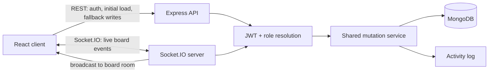

<div align="center">


# SDLCFlow

**A real-time project workspace for software teams — plan work, move it across the lifecycle, and watch your teammates do the same, live.**


</div>

---

## The problem

A Kanban board is easy to build and hard to build *well*. The moment two people
open the same board, the interesting questions start: who is allowed to move this
card, what happens when both of them drag it at once, how does the second browser
find out, and what does the app do when the connection drops mid-drag?

SDLCFlow is a full-stack project workspace built around those questions rather than
around the CRUD. Every mutation is authorised on the server, persisted, recorded
in an activity log, acknowledged to the sender, and broadcast to everyone else on
the board — over WebSockets, in that order.

<div align="center">


</div>

---

## Features

### My Tasks

A personal task view brings together cards assigned to you across your projects.
Open work is grouped into Overdue, Today, Upcoming, and No due date, with completed
tasks kept separately. Search and project filters help narrow the list; selecting
a task opens its details in the correct project workflow. Checklist progress is
visible alongside each task. See [My Tasks documentation](docs/my-tasks.md).

### Projects contain workflows, workflows contain tasks

Projects carry a name, one of ten engineering icons, and a colour, so a
workspace of six active builds stays readable. Inside a project, workflows group
different kinds of work, lists are the states work moves through, and cards are
the tasks. Lists and cards both drag with [dnd-kit](https://dndkit.com) and both
persist their new order the moment you drop them — optimistically, with a
rollback and a toast if the server disagrees.

Ordering uses fractional positions, so moving one card writes one document
instead of renumbering the column.

New projects start as clean containers with a default General workflow.
Software-focused workflow templates now live inside each project, where owners
and admins can add sprints, GitHub-style issue tracking, bug triage, roadmaps,
personal development, release planning, or a custom workflow as separate project
areas.

<div align="center">


</div>

### Live collaboration, not polling

Open the same board in two browsers and the second one keeps up. Card and list
creates, edits, moves, deletes, comments, and board chat messages all travel over
Socket.IO, and the header shows who else is currently looking at the board.

The handshake is where authorisation starts, not where it is bolted on:

1. The JWT is verified **during** the Socket.IO handshake — an unauthenticated
   socket never reaches a room or an event handler.
2. `board:join` re-checks membership for that specific board. Proving who you are
   is not the same as proving you belong here.
3. Every mutating event checks the caller's board role before touching anything.
4. The change is persisted, then recorded as activity.
5. The sender gets an ack carrying the saved document.
6. The board room gets the broadcast, sender excluded.

Presence is tracked per user rather than per socket — three tabs is still one
person online — and broadcasts are throttled by 500 ms so a refresh doesn't spray
the room with near-identical member lists.

Losing the socket degrades rather than breaks: every mutation goes through a
`realtimeOrRest` helper that falls back to the equivalent REST call, so you can
keep working offline-of-the-socket and the board re-fetches on reconnect rather
than trusting stale local state.

### Roles that the server actually enforces

Hiding a button is a nicety; the API is where permission is decided. Every REST
handler and every socket event resolves the caller's role on that board first,
and non-members get a `404` rather than a `403`, so a private board never
confirms its own existence to a stranger.

| | Member | Admin | Owner |
|---|:---:|:---:|:---:|
| View the board, its activity and members | ✅ | ✅ | ✅ |
| Create, edit, move and delete lists and cards | ✅ | ✅ | ✅ |
| Comment on cards | ✅ | ✅ | ✅ |
| Rename the board, change its icon and colour | — | ✅ | ✅ |
| Add and remove members | — | ✅ | ✅ |
| Promote a member to admin | — | — | ✅ |
| Delete the board | — | — | ✅ |

<div align="center">


</div>

The dots on each avatar are live presence — teal for the two people on the board
right now, grey for the one who isn't.

### Cards carry the metadata a software task needs

Cards also include a shared to-do checklist: add, rename, complete, and remove
items in the detail modal, with automatic saving and live updates for teammates.
Completion counts appear on the workflow cards. See [checklist documentation](docs/checklists.md)
for the API contract and collaboration behavior.

A card opens into a detail view with a description, a workflow stage, one of seven
tags (Task, Feature, Bug, Design, Research, Docs, Chore), one of five statuses
(Todo, In Progress, Review, Blocked, Done), an assignee, and a due date. Due dates
turn amber as they approach.

Assignees are validated against board membership on the server, so a card can't be
assigned to someone who can't open it.

Comments are realtime too — post one and it appears in every other open copy of
that card, and lands in the board's activity feed.

<div align="center">


</div>

### An activity trail for everything

Every create, update, move, delete, comment, and membership change is written to
an activity log as it happens. Read it per board from the board's own panel, or
across every board you belong to at `/activity`.

<div align="center">


</div>

### GitHub context inside your workspace

Most project tools ask you to describe work that already exists in git. SDLCFlow
reads it instead. Connect a GitHub account once from your profile and repository
context flows into the dashboard, into individual projects, and into the activity
feed.

**Connecting happens on the profile page** over OAuth, asking for `read:user`,
`user:email` and `repo`. The card there shows the connected account and offers a
disconnect that actually cleans up after itself.

**The dashboard panel summarises the account as a whole:** total repositories,
how many are private, how many SDLCFlow projects are linked to a repo, and how
many distinct repositories that covers. Alongside those sit commit counts for
today, this week and this year, a contribution heatmap of recent daily activity,
your primary repository languages ranked by how many repos use each, and the
projects you have already linked.

<div align="center">


</div>

**Each project links one repository.** Owners and admins choose it from a
searchable list of everything the connected account can see, and can change or
unlink it later; members see the linked repo and its data but can't rewire it.
The project panel shows recent commits next to the count of open pull requests
and open issues.

Project reads use the token of whoever linked the repo, so the rest of the team
gets repository context without each person having to connect their own GitHub
account.

<div align="center">


</div>

**Synced commits land in the project activity feed** beside the card moves and
comments, so a single timeline answers "what happened on this project". Commits
are deduped by SHA against what is already recorded, and any one sync adds at
most five — linking a busy repository shouldn't bury everything else that
happened.

**Cards can carry a GitHub reference** — an issue, pull request, commit, or
repository URL — which renders as a labelled link in the card detail view.

**Hardening.** Access tokens are encrypted with AES-256-GCM before they reach the
database, and the field is `select: false` so it never loads by accident.
Disconnecting makes a best-effort call to GitHub's token revocation endpoint and
removes the local connection either way, so a GitHub outage can't strand a live
token in your database; every project repo link belonging to that account is
deleted in the same operation. Rate limits are read from GitHub's own headers and
surfaced as a clear message instead of a generic failure, and connections made
before the `repo` scope was required are asked to reconnect rather than failing
opaquely.

### Project chat for project conversation

Every project has its own realtime chat drawer. Messages are persisted to MongoDB,
loaded over REST when the drawer opens, and sent over Socket.IO when connected
with REST fallback when the socket is unavailable. Only project members can read or
send messages. The project header shows an unread badge while the drawer is
closed, messages are grouped by day, and the composer supports Enter to send
with Shift+Enter for multiline notes. Typing indicators show when another
project member is writing. People can delete their own messages, and owners can
clear a project's chat when a conversation needs a reset. If a send fails, the
message stays in the thread with a retry action instead of disappearing.

### Search, filters, and a dark mode that isn't an afterthought

Projects filter by name and sort by recent activity, creation date, or name. Cards
filter by title, description, tag, and status, with the counts updating as you
type. The theme follows your OS by default and is remembered once you override it.

<div align="center">


</div>

### Account management

Profile editing, password changes with the current password required, workspace
statistics, and account deletion that cleans up the personal data it leaves
behind.

---

## Architecture



The decision worth pointing at: **REST and Socket.IO mutations run through the
same service layer.** A card update gets identical validation, permission checks,
persistence, activity logging, and response shape whether it arrived as an HTTP
`PATCH` or a live socket event. The transport changes; the rules don't.

---

## Running it locally

You need Node 20+ and a MongoDB connection string (a free Atlas cluster is fine).

```bash
git clone https://github.com/qadeerdev12/SDLCFlow.git
cd SDLCFlow
```

Server:

```bash
cd server && npm install && cp .env.example .env && npm run dev
```

Client, in a second terminal:

```bash
cd client && npm install && cp .env.example .env && npm run dev
```

The client runs on `http://localhost:5173` and the API on `http://localhost:5050`.

<div align="center">


</div>

Register two accounts in two browsers, add the second one to a board from the
members panel, and drag a card — that is the whole feature in one gesture.

### Environment variables

**`server/.env`**

| Variable | Required | Purpose |
|---|:---:|---|
| `MONGO_URI` | yes | MongoDB connection string |
| `JWT_SECRET` | yes | Secret used to sign and verify tokens |
| `PORT` | no | HTTP and Socket.IO port. Defaults to `5050` |
| `CLIENT_ORIGIN` | no | Comma-separated allowed browser origins |
| `CLIENT_URL` | no | Browser URL used after OAuth redirects |
| `GITHUB_CLIENT_ID` | for GitHub | GitHub OAuth app client id |
| `GITHUB_CLIENT_SECRET` | for GitHub | GitHub OAuth app client secret |
| `GITHUB_CALLBACK_URL` | for GitHub | OAuth callback URL registered in GitHub |
| `GITHUB_TOKEN_ENCRYPTION_KEY` | for GitHub | Long random secret used to encrypt stored GitHub tokens |

**`client/.env`**

| Variable | Required | Purpose |
|---|:---:|---|
| `VITE_API_URL` | no | REST base URL. Defaults to `http://localhost:5050/api/v1` |
| `VITE_SOCKET_URL` | no | Socket.IO URL. Defaults to `http://localhost:5050` |

---

## Tests

```bash
cd server && npm test
```

Thirty-five integration tests run against an in-memory MongoDB and a real
Socket.IO server — no mocks standing in for the parts most likely to be wrong.
They cover the permission matrix above, the handshake rejecting invalid JWTs,
membership being checked before a room join, broadcasts reaching collaborators
while acking the sender, assignee validation, workflow template creation,
comment/chat scoping, and account deletion.

Nine of them cover the GitHub integration specifically: endpoints refusing to
answer before an account is connected, tokens surviving a round trip through
encryption while staying usable for API calls, disconnect revoking the token and
removing linked project repos, rate limits returning a clear response, dashboard
stats aggregation, role enforcement on project repo links, commit sync recording
activity without duplicates, older connections being asked to reconnect for the
`repo` scope, and cards storing GitHub references.

Client checks:

```bash
cd client && npm run lint && npm run build
```

---

## Project structure

```text
client/src/
  components/   board columns, cards, panels, modals
  context/      auth, theme, toast providers
  hooks/        useSocket — the client's Socket.IO lifecycle
  lib/          API client, board colours and icons, card metadata
  pages/        landing, auth, dashboard, board, activity, profile

server/src/
  controllers/  REST handlers, including GitHub account and project repo links
  data/         read-only workflow template catalog
  routes/       auth, board, template and GitHub integration routers
  services/     shared mutation, chat, activity and GitHub API logic
  socket.js     handshake auth, rooms, presence, board events, chat events
  models/       User, Board, List, Card, Comment, Message, Activity,
                GitHubAccount, BoardGitHubIntegration
  utils/        board access and role resolution
```

---

## Documentation

| Doc | What's in it |
|---|---|
| [Product requirements](docs/01-PRD.md) | Goals, users, scope, acceptance criteria |
| [System design](docs/02-system-design.md) | Architecture and the trade-offs behind it |
| [Data model](docs/03-data-model.md) | Collections, relationships, embed-vs-reference decisions |
| [API specification](docs/04-api-spec.md) | REST endpoints and the Socket.IO event contract |
| [Sprint plan](docs/05-sprint-plan.md) | Process, backlog, milestones, definition of done |
| [Realtime architecture](docs/06-realtime-architecture.md) | Socket implementation notes and maintenance guide |

---

## Known limitations

**Adding a member requires them to have an account already.** You invite by
email, and the server looks that email up. There is no email invitation flow yet.

**Reconnecting re-fetches the board rather than replaying what it missed.** It is
correct and simple, and it costs one extra request after a dropped connection.
Event replay is on the backlog.

**Repository linking is manual, one repo per project.** You pick the repo from
the project panel; there is no auto-matching by name and no support for a project
that spans several repositories.

**One server instance.** Socket.IO rooms live in that process's memory, so running
two instances behind a load balancer would split the rooms. Fixing that is a Redis
adapter, deliberately deferred until there is a reason to scale horizontally.

**Fractional positions have no rebalance job.** Repeatedly dropping a card into
the same gap will eventually exhaust float precision. Thousands of moves away, but
real.

**JWTs last seven days with no refresh token.** Logging out clears the token
client-side; it stays valid server-side until it expires.

**Not deployed yet.** It runs locally against Atlas; Vercel and Render are the
intended hosts and the environment variables above are already wired for them.

---

## Licence

MIT
