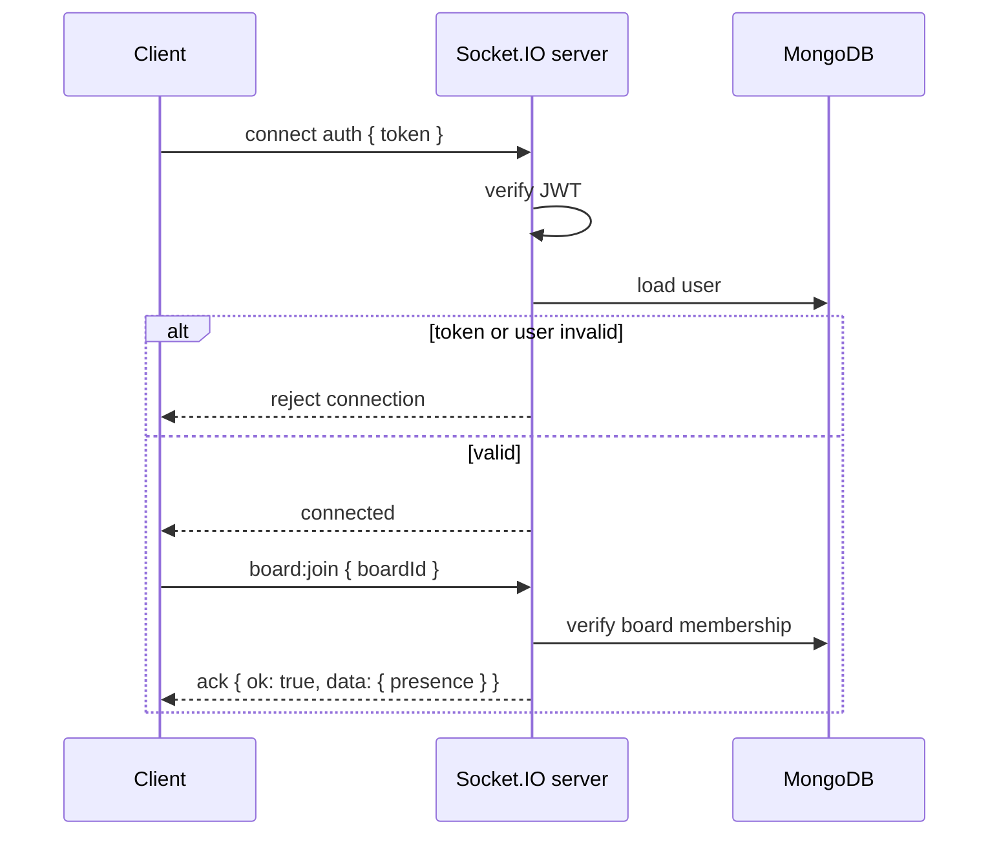

# 06 - Realtime Architecture

**Project:** SDLCFlow
**Status:** Implemented foundation

This document explains how SDLCFlow's Socket.IO layer works today. It is meant for future maintainers who need to add events, debug sync issues, or extend the board into multi-user project management.

---

## Goals

- Authenticate socket connections with the same JWT used by REST.
- Let clients join only board rooms they are members of.
- Persist every mutation before broadcasting it.
- Broadcast changes to the board room, excluding the sender.
- Keep REST and Socket.IO writes on the same service functions.
- Record activity for board mutations and broadcast it live.
- Re-fetch board state after reconnect so the client can recover from missed events.

---

## Key Files

| File | Responsibility |
|---|---|
| `server/src/index.js` | Creates Express + HTTP server, attaches Socket.IO, configures CORS, calls `configureSockets(io)` |
| `server/src/socket.js` | JWT socket auth, `board:join`, presence tracking, card/list realtime events |
| `server/src/services/boardMutationService.js` | Shared card/list write logic used by both REST controllers and socket handlers |
| `server/src/services/activityService.js` | Shared board activity logging and realtime activity broadcast |
| `server/src/services/chatService.js` | Shared board chat validation, persistence, deletion, and clearing |
| `server/src/services/workflowService.js` | Shared project workflow validation and persistence |
| `server/src/controllers/cardController.js` | REST card endpoints, delegated to the shared mutation service |
| `server/src/controllers/listController.js` | REST list endpoints, delegated to the shared mutation service |
| `server/src/controllers/messageController.js` | REST board chat history, message creation, and moderation |
| `client/src/hooks/useSocket.js` | Socket.IO client lifecycle, ack-based emits, event subscription helper |
| `client/src/pages/BoardPage.jsx` | Joins board rooms, applies incoming events, emits local card/list mutations |

---

## Connection Flow



The server stores the authenticated user on `socket.data.user`. Joined board ids are stored in `socket.data.boardIds` so presence can be cleaned up on disconnect.

---

## Rooms

Each open board maps to a Socket.IO room:

```text
board:<boardId>
```

The client cannot join a room directly. It must emit `board:join`; the server verifies membership using `getBoardIfMember` before calling `socket.join(...)`. Mutations use stricter role checks through `getBoardIfRole`.

---

## Ack Envelope

All mutation events use an ack callback.

Success:

```json
{
  "ok": true,
  "data": {}
}
```

Failure:

```json
{
  "ok": false,
  "error": {
    "code": "VALIDATION",
    "message": "Card title is required."
  }
}
```

The client helper `emitWithAck` rejects the Promise when:

- the socket is not connected
- the server times out
- the server returns `{ ok: false }`

---

## Event Contract

### Client to Server

| Event | Payload | Ack data |
|---|---|---|
| `board:join` | `{ boardId }` | `{ boardId, presence }` |
| `card:create` | `{ boardId, title, listId, position, workflowId?, tag?, status?, assignee?, dueDate? }` | `{ card, activity }` |
| `card:update` | `{ boardId, cardId, updates }` | `{ card, activity }` |
| `card:move` | `{ boardId, cardId, list, position }` | `{ card, activity }` |
| `card:delete` | `{ boardId, cardId }` | `{ deleted: true, activity }` |
| `comment:create` | `{ boardId, cardId, body }` | `{ comment, activity }` |
| `message:create` | `{ boardId, body }` | `{ message }` |
| `chat:typing` | `{ boardId, typing }` | `{ typing }` |
| `message:delete` | `{ boardId, messageId }` | `{ message, activity }` |
| `chat:clear` | `{ boardId }` | `{ deletedCount, activity }` |
| `list:create` | `{ boardId, title, position, workflowId? }` | `{ list, activity }` |
| `list:update` | `{ boardId, listId, updates }` | `{ list, activity }` |
| `list:move` | `{ boardId, listId, position }` | `{ list, activity }` |
| `list:delete` | `{ boardId, listId }` | `{ deleted: true, activity }` |

### Server to Client

| Event | Payload | Notes |
|---|---|---|
| `presence:update` | `{ boardId, users }` | throttled to avoid noisy connect/disconnect storms |
| `card:created` | `{ boardId, card }` | emitted after DB create |
| `card:updated` | `{ boardId, card }` | emitted after DB update |
| `card:moved` | `{ boardId, card }` | emitted after DB update |
| `card:deleted` | `{ boardId, cardId }` | emitted after DB delete |
| `comment:created` | `{ boardId, cardId, comment }` | emitted after DB create |
| `message:created` | `{ boardId, message }` | emitted after DB create |
| `chat:typing` | `{ boardId, user, typing }` | ephemeral typing status, not persisted |
| `message:deleted` | `{ boardId, message }` | emitted after soft-delete |
| `chat:cleared` | `{ boardId, deletedCount }` | emitted after owner clears visible history |
| `list:created` | `{ boardId, list }` | emitted after DB create |
| `list:updated` | `{ boardId, list }` | emitted after DB update |
| `list:moved` | `{ boardId, list }` | emitted after DB update |
| `list:deleted` | `{ boardId, listId }` | emitted after DB delete |
| `workflow:created` | `{ boardId, workflow, lists, cards }` | emitted after REST workflow creation and template seeding |
| `members:updated` | `{ boardId, members }` | emitted after REST member changes |
| `activity:created` | `{ boardId, activity }` | emitted after activity is recorded |
| `board:error` | `{ code, message }` | emitted only when an event was sent without an ack callback |

Socket mutation broadcasts use `socket.to(roomName(board._id)).emit(...)`, so the sender is excluded. The sender updates its own UI from the ack response.

REST-triggered broadcasts use the app-level Socket.IO server because there is
no originating socket to exclude. This includes the author's other connected
tabs and an author who reconnects while their HTTP save is pending.

Card/list REST controllers use the shared mutation services, record activity,
then emit the matching saved entity or deleted ID to `board:<boardId>`:

| REST operation | Event |
| --- | --- |
| Create card/list | `card:created` / `list:created` |
| Edit card (including checklist) / rename list | `card:updated` / `list:updated` |
| Move card / position-only list update | `card:moved` / `list:moved` |
| Delete card/list | `card:deleted` / `list:deleted` |

Checklist edits use the same single broadcast as other card edits, not an extra
special-case event. Failed authorization, validation, or mutation persistence
does not broadcast. Socket-origin writes retain sender exclusion and are not
broadcast again by the shared services. REST still works without an attached
Socket.IO server, for example in standalone API tests.

The page applies both create responses and socket create events through
`client/src/lib/boardState.js`. Existing IDs are retained, including a card that
has already moved or a list that was renamed. A repeated list creation must not
clear cards already received for that list. Workflow and member merges retain
their existing ID-based behavior.

`server/src/__tests__/restBroadcasts.test.js` uses isolated MongoDB and real socket
clients to verify delivery, saved payloads, room isolation, rejection paths, and
unchanged socket sender exclusion. Client state and page tests exercise both
HTTP-first and socket-first create delivery during reconnection.

Card/list creation payloads share the REST validation path. `workflowId` is
optional; when omitted, lists use the board's first workflow and cards inherit
the target list's workflow. Card moves are constrained to the card's current
workflow, and direct `workflow`/`workflowId` updates are rejected for both lists
and cards until the client has an intentional cross-workflow move flow.
`updates.assignee` must be empty/null or a member of the board, and
`updates.dueDate` must be a valid date string or null.

---

## Persistence Rule

Every board work mutation follows this order:

1. Verify the required board role.
2. Call the shared mutation service.
3. Wait for MongoDB persistence to succeed.
4. Record activity for the saved mutation.
5. Ack the sender with the persisted document and activity.
6. Broadcast the persisted document and activity to the rest of the room.

If persistence fails, the server returns a negative ack and does not broadcast.

Chat messages follow the same persist-then-broadcast rule. Normal chat messages
do not record activity because chat is conversational rather than an audit
event. Moderation actions do record activity: `message.deleted` for individual
message deletes and `chat.cleared` when an owner clears visible chat history.

---

## Presence

Presence is stored in memory:

```text
boardId -> userId -> { user, sockets, lastSeen }
```

Why sockets are tracked per user:

- one user can open the same board in multiple tabs
- the user should remain present until their last tab disconnects

Presence broadcasts are throttled by board for 500ms. This avoids rapid event bursts when someone refreshes or opens multiple tabs.

Current limitation: presence is process-local. If the server runs multiple instances later, use a shared adapter/store such as Redis for Socket.IO rooms and presence state.

---

## Client Strategy

`BoardPage.jsx` uses socket-first writes:

1. If connected, emit the matching realtime mutation.
2. Use the ack response to update local state.
3. If disconnected, fall back to the REST endpoint.

Incoming events update local state only when the event belongs to the current `boardId`.

On reconnect, the board re-joins its room and re-fetches the full board snapshot. That keeps the UI correct even if events were missed while offline.

Member management currently happens through REST endpoints. Those endpoints broadcast `members:updated` to the board room so open board pages update their members panel and permissions live. If the current user is removed from a board, the client redirects them back to the dashboard.

Activity is fetched over REST on board load and then updated by `activity:created` socket events. Socket mutation senders receive activity in the ack response, while collaborators receive it through the board room broadcast.

Workflows use REST for creation and Socket.IO for live fan-out. `GET /boards/:boardId` returns
`workflows`, and `GET/POST /boards/:boardId/workflows` lets members view and
owners/admins add project areas. New projects receive a default `General`
workflow, and older boards are lazily backfilled when loaded. Lists/cards that
do not yet have a workflow are attached to the default workflow before the board
snapshot is returned. `POST /boards/:boardId/workflows` broadcasts
`workflow:created` with the saved workflow plus any template-seeded lists/cards
so open board pages can merge the new project area without a reload.

Project chat history is fetched over REST when the chat drawer opens. New messages use the same socket-first/fallback-to-REST pattern as board mutations. Chat messages are persisted and broadcast as `message:created`, but they are intentionally not recorded in the board activity log.

The client keeps chat state board-scoped. Switching boards clears loaded chat
history, errors, and unread counts. When a `message:created` event arrives while
the drawer is closed, the board header badge increments; opening the drawer
resets that count. The chat composer sends on Enter and keeps Shift+Enter for
multiline messages.

Typing indicators are socket-only polish. The server verifies board membership
before broadcasting `chat:typing`, but it does not persist the event or create
activity. The client removes stale typing indicators after a short timeout and
sends a final `typing: false` when the drawer closes or a message sends.

Message delivery state is also client-only. `BoardPage.jsx` inserts a temporary
message with `deliveryStatus: "sending"` before the socket/REST call finishes.
On success, the temporary message is replaced with the persisted MongoDB
message. On failure, it remains visible with `deliveryStatus: "failed"` and can
be retried from the chat bubble.

Individual deletes are soft deletes: the message keeps its timestamp and sender
but renders as a deleted placeholder. Clear-chat marks the existing messages as
cleared so the drawer empties for open clients and future history loads start
fresh.

---

## Adding a New Realtime Mutation

1. Add or reuse a function in `server/src/services/boardMutationService.js`.
2. Add the REST controller path if the action should work without sockets.
3. Add a `registerMutation(...)` handler in `server/src/socket.js`.
4. Persist first, then broadcast the server-returned document.
5. Add a client helper or page handler that uses `emitWithAck`.
6. Add an incoming event listener in `BoardPage.jsx`.
7. Record activity if the mutation should appear in the board timeline.
8. Update this document and `docs/04-api-spec.md`.

---

## Known Follow-ups

- Add ownership transfer if boards need multiple owner workflows.
- Move presence to a shared adapter if the app runs more than one server instance.
- Add broader cross-board mutation tests as the API surface grows.
